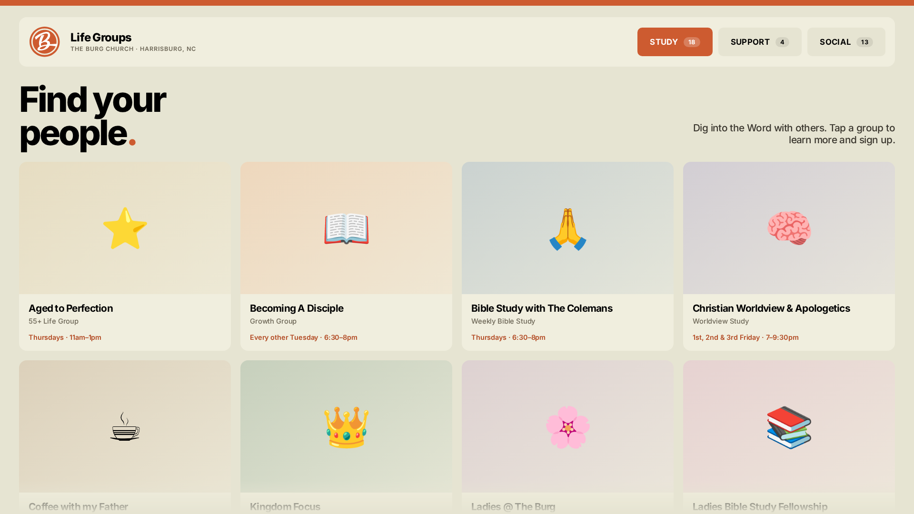
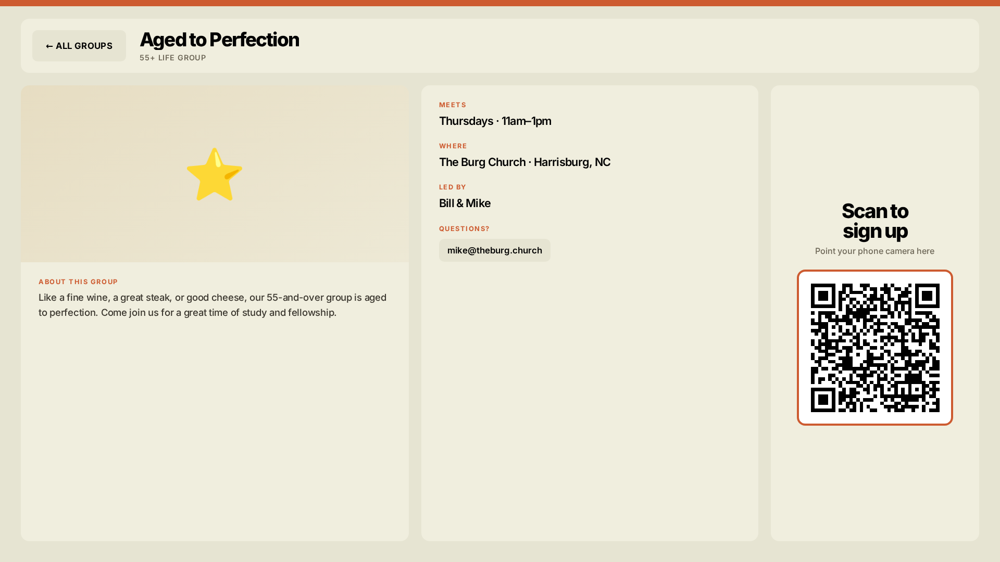
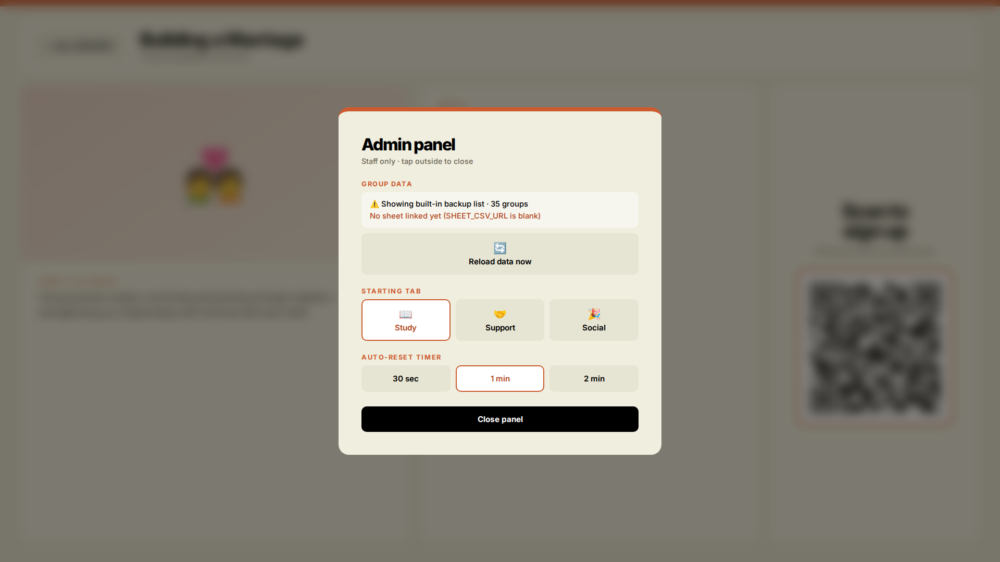

# The Burg Church · Life Groups Kiosk

A touchscreen directory for the lobby of The Burg Church in Harrisburg, NC. Visitors browse 35 life groups on an 80-inch display, tap one to see when and where it meets, and scan a QR code to sign up on their phone.

## The problem

The Burg has 35 life groups across three categories, but if you were new, there was no easy way to find one. The info lived online where most visitors never looked, and people who didn't already know someone had no clear next step. The goal was simple: anyone walking through the lobby should be able to find a group in under a minute without asking staff.

## What it does

- **Browse by category.** Study, Support, and Social tabs, with large cards sized for touch on an 80-inch screen.
- **Group details.** Meeting time, location, leaders, contact, and a description for each group.
- **Scan to sign up.** Each group shows a QR code that opens its Church Center sign-up page.
- **Auto-reset.** After a minute of no touches, it returns to the start screen for the next person.
- **Hidden admin panel.** Tap the top-right corner five times to reload data, pick the starting tab, or change the reset timer.
- **Staff-editable.** Group info comes from a Google Sheet. Staff edit the sheet, and the kiosk picks up changes within 15 minutes. No one has to touch code.
- **Works offline.** If the internet drops, it shows the last data it loaded. If it has never loaded, it falls back to a built-in list. Fonts and the QR generator are embedded in the file.

| Group detail | Admin panel |
| --- | --- |
|  |  |

## How it's built

One self-contained HTML file with vanilla JavaScript and no frameworks, build step, or server. That was deliberate: the church has no developer on staff, so the kiosk needs to be something you can drop onto any computer, open in a browser, and leave running.

Data loads in this order:

1. **Google Sheet** (published as CSV), re-checked every 15 minutes
2. **Saved copy** of the last successful load, stored in the browser
3. **Built-in backup list** inside the file

Built with Claude as a coding partner. I scoped the features, made the design and architecture calls, and tested and iterated on each version.

## Running it

Open `index.html` in Chrome in fullscreen/kiosk mode. That's it.

To connect live data:

1. Copy the columns in [`sample-sheet.csv`](sample-sheet.csv) into a Google Sheet.
2. In the sheet, go to **File → Share → Publish to web**, pick the tab, and choose **Comma-separated values (.csv)**.
3. Paste that link into `SHEET_CSV_URL` in the `CONFIG` block near the bottom of `index.html`.

Staff instructions for day-to-day updates are in [`docs/staff-guide.md`](docs/staff-guide.md).

## What I'd do differently

The first version hardcoded every group directly in the HTML. It worked, but it meant any change to a meeting time needed me. I rebuilt the data layer around a Google Sheet so the people who actually run the groups can own it. Next time I'd ask staff how they want to maintain something before building it, not after.

I also redesigned it once to match the church's current website instead of my own first take on the brand. Starting from their real site on day one would have saved a full round of work.

## Status

Built and tested. Installation on the lobby display is scheduled once the church's building project wraps up. Remaining before launch: link the live Google Sheet and add group photos from the church's photo library.

> Group photos are embedded in the deployed version but left out of this public repo for privacy. Without them, cards show a tinted icon tile, which is what you see in the screenshots.
